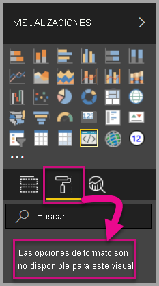
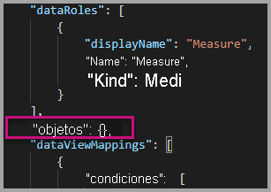
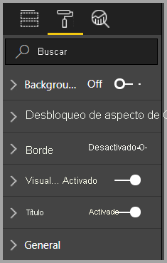
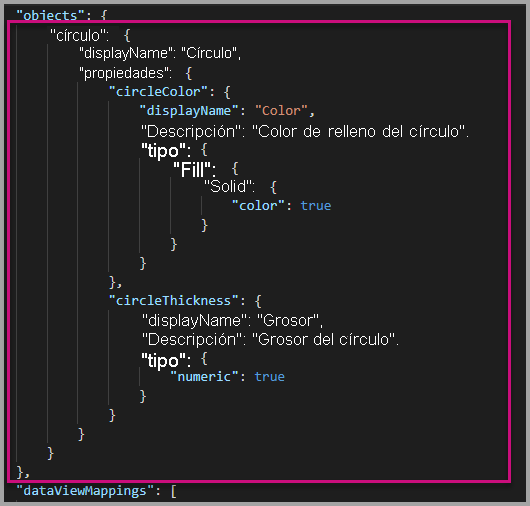
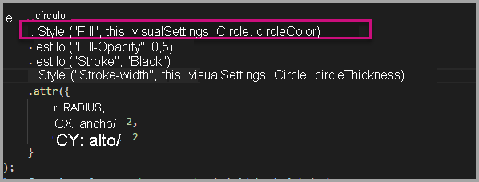
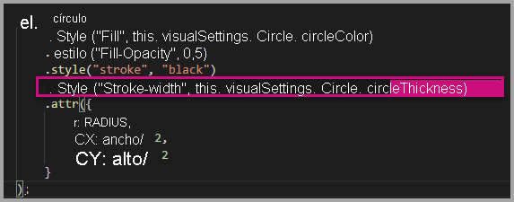
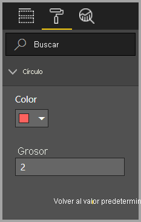
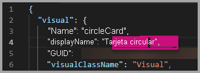
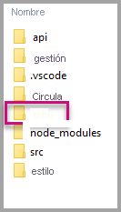
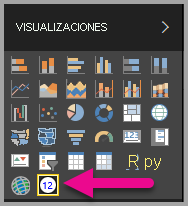

# <a name="tutorial-adding-formatting-options-to-a-power-bi-visual"></a><span data-ttu-id="6263b-103">Tutorial: Adición de opciones de formato a un objeto visual de Power BI</span><span class="sxs-lookup"><span data-stu-id="6263b-103">Tutorial: Adding formatting options to a Power BI visual</span></span>

<span data-ttu-id="6263b-104">En este tutorial aprenderá a agregar propiedades comunes al objeto visual.</span><span class="sxs-lookup"><span data-stu-id="6263b-104">In this tutorial, we go through how to add common properties to the visual.</span></span>

<span data-ttu-id="6263b-105">En este tutorial, obtendrá información sobre cómo:</span><span class="sxs-lookup"><span data-stu-id="6263b-105">In this tutorial, you learn how to:</span></span>
> [!div class="checklist"]
> * <span data-ttu-id="6263b-106">Agregar propiedades de los objetos visuales.</span><span class="sxs-lookup"><span data-stu-id="6263b-106">Add visual properties.</span></span>
> * <span data-ttu-id="6263b-107">Empaquetar el objeto visual.</span><span class="sxs-lookup"><span data-stu-id="6263b-107">Package the visual.</span></span>
> * <span data-ttu-id="6263b-108">Importar el objeto visual personalizado a un informe de Power BI Desktop.</span><span class="sxs-lookup"><span data-stu-id="6263b-108">Import the custom visual to a Power BI Desktop report.</span></span>

## <a name="adding-formatting-options"></a><span data-ttu-id="6263b-109">Adición de opciones de formato</span><span class="sxs-lookup"><span data-stu-id="6263b-109">Adding formatting options</span></span>

1. <span data-ttu-id="6263b-110">En **Power BI**, seleccione la **página Formato**.</span><span class="sxs-lookup"><span data-stu-id="6263b-110">In **Power BI**, select the **Format page**.</span></span>

    <span data-ttu-id="6263b-111">Debería ver un mensaje que dice: *Las opciones de formato no están disponibles para este objeto visual.*</span><span class="sxs-lookup"><span data-stu-id="6263b-111">You should see a message that reads - *Formatting options are unavailable for this visual.*</span></span>

    

2. <span data-ttu-id="6263b-113">En **Visual Studio Code**, abra el archivo *capabilities.json*.</span><span class="sxs-lookup"><span data-stu-id="6263b-113">In **Visual Studio Code**, open the *capabilities.json* file.</span></span>

3. <span data-ttu-id="6263b-114">Antes de la matriz **dataViewMappings**, agregue **objects** (después de la línea 8).</span><span class="sxs-lookup"><span data-stu-id="6263b-114">Before the **dataViewMappings** array, add **objects** (after line 8).</span></span>

    ```json
    "objects": {},
    ```

    

4. <span data-ttu-id="6263b-116">Guarde el archivo **capabilities.json**.</span><span class="sxs-lookup"><span data-stu-id="6263b-116">Save the **capabilities.json** file.</span></span>

5. <span data-ttu-id="6263b-117">En **Power BI**, vuelva a revisar las opciones de formato.</span><span class="sxs-lookup"><span data-stu-id="6263b-117">In **Power BI**, review the formatting options again.</span></span>

    > [!Note]
    > <span data-ttu-id="6263b-118">Si no ve el cambio de opciones de formato, seleccione **Reload Custom Visual** (Recargar objeto visual personalizado).</span><span class="sxs-lookup"><span data-stu-id="6263b-118">If you do not see the formatting options change then select **Reload Custom Visual**.</span></span>

    

6. <span data-ttu-id="6263b-120">Establezca la opción **Title** (Título) en *Off* (Desactivar).</span><span class="sxs-lookup"><span data-stu-id="6263b-120">Set the **Title** option to *Off*.</span></span> <span data-ttu-id="6263b-121">Tenga en cuenta que el objeto visual ya no muestra el nombre de medida en la esquina superior izquierda.</span><span class="sxs-lookup"><span data-stu-id="6263b-121">Notice that the visual no longer displays the measure name at the top-left corner.</span></span>

    

    

### <a name="adding-custom-formatting-options"></a><span data-ttu-id="6263b-124">Adición de opciones de formato personalizadas</span><span class="sxs-lookup"><span data-stu-id="6263b-124">Adding custom formatting options</span></span>

<span data-ttu-id="6263b-125">Puede agregar propiedades personalizadas para permitir la configuración del color del círculo y también del ancho del borde.</span><span class="sxs-lookup"><span data-stu-id="6263b-125">You can add custom properties to enable configuring the color of the circle, and also the border width.</span></span>

1. <span data-ttu-id="6263b-126">En PowerShell, detenga el objeto visual personalizado.</span><span class="sxs-lookup"><span data-stu-id="6263b-126">In PowerShell, stop the custom visual.</span></span>

2. <span data-ttu-id="6263b-127">En Visual Studio Code, en el archivo **capabilities.json**, inserte el siguiente fragmento de JSON en el objeto que tiene la etiqueta **objects**.</span><span class="sxs-lookup"><span data-stu-id="6263b-127">In Visual Studio Code, in the **capabilities.json** file, insert the following JSON fragment into the object labeled **objects**.</span></span>

    ```json
    "circle": {
     "displayName": "Circle",
     "properties": {
         "circleColor": {
             "displayName": "Color",
             "description": "The fill color of the circle.",
             "type": {
                 "fill": {
                     "solid": {
                         "color": true
                     }
                 }
             }
         },
         "circleThickness": {
             "displayName": "Thickness",
             "description": "The circle thickness.",
             "type": {
                 "numeric": true
                 }
             }
         }
     },
    ```

    <span data-ttu-id="6263b-128">El fragmento de JSON describe un grupo denominado círculo, que consta de dos opciones con nombre circleColor y circleThickness.</span><span class="sxs-lookup"><span data-stu-id="6263b-128">The JSON fragment describes a group named circle, which consists of two options named circleColor and circleThickness.</span></span>

   

3. <span data-ttu-id="6263b-130">Guarde el archivo **capabilities.json**.</span><span class="sxs-lookup"><span data-stu-id="6263b-130">Save the **capabilities.json** file.</span></span>

4. <span data-ttu-id="6263b-131">En el **panel Explorador**, desde dentro de la carpeta **src** y, después, seleccione **settings.ts**.</span><span class="sxs-lookup"><span data-stu-id="6263b-131">In the **Explorer pane**, from inside the **src** folder, and then select **settings.ts**.</span></span> <span data-ttu-id="6263b-132">*Este archivo representa la configuración para el objeto visual de inicio*.</span><span class="sxs-lookup"><span data-stu-id="6263b-132">*This file represents the settings for the starter visual*.</span></span>

5. <span data-ttu-id="6263b-133">En el archivo **settings.ts**, reemplace las dos clases por el código siguiente.</span><span class="sxs-lookup"><span data-stu-id="6263b-133">In the **settings.ts** file, replace the two classes with the following code.</span></span>

    ```typescript
    export class CircleSettings {
        public circleColor: string = "white";
        public circleThickness: number = 2;
    }
    export class VisualSettings extends DataViewObjectsParser {
        public circle: CircleSettings = new CircleSettings();
    }
    ```

    

    <span data-ttu-id="6263b-135">Este módulo define las dos clases.</span><span class="sxs-lookup"><span data-stu-id="6263b-135">This module defines the two classes.</span></span> <span data-ttu-id="6263b-136">La clase **CircleSettings** define dos propiedades con nombres que coinciden con los objetos definidos en el archivo **capabilities.json** (**circleColor** y **circleThickness**) y también establece valores predeterminados.</span><span class="sxs-lookup"><span data-stu-id="6263b-136">The **CircleSettings** class defines two properties with names that match the objects defined in the **capabilities.json** file (**circleColor** and **circleThickness**) and also sets default values.</span></span> <span data-ttu-id="6263b-137">La clase **VisualSettings** hereda la clase **DataViewObjectParser** y agrega una propiedad llamada **circle**, que coincide con el objeto definido en el archivo *capabilities.json*, y devuelve una instancia de **CircleSettings**.</span><span class="sxs-lookup"><span data-stu-id="6263b-137">The **VisualSettings** class inherits the **DataViewObjectParser** class and adds a property named **circle**, which matches the object defined in the *capabilities.json* file, and returns an instance of **CircleSettings**.</span></span>

6. <span data-ttu-id="6263b-138">Guarde el archivo **settings.ts**.</span><span class="sxs-lookup"><span data-stu-id="6263b-138">Save the **settings.ts** file.</span></span>

7. <span data-ttu-id="6263b-139">Abra el archivo **visual.ts**.</span><span class="sxs-lookup"><span data-stu-id="6263b-139">Open the **visual.ts** file.</span></span>

8. <span data-ttu-id="6263b-140">En el archivo \*\*visual. ts @ no__t-1,</span><span class="sxs-lookup"><span data-stu-id="6263b-140">In the **visual.ts** file,</span></span>

    <span data-ttu-id="6263b-141">Import `VisualSettings` (clase)</span><span class="sxs-lookup"><span data-stu-id="6263b-141">import `VisualSettings` class</span></span>

    ```typescript
    import { VisualSettings } from "./settings";
    ```

    <span data-ttu-id="6263b-142">y en la clase \*\*Visual @ no__t-1 Agregue la siguiente propiedad:</span><span class="sxs-lookup"><span data-stu-id="6263b-142">and in the **Visual** class add the following property:</span></span>

    ```typescript
    private visualSettings: VisualSettings;
    ```

    <span data-ttu-id="6263b-143">Esta propiedad almacena una referencia al objeto **VisualSettings**, que describe la configuración visual.</span><span class="sxs-lookup"><span data-stu-id="6263b-143">This property stores a reference to the **VisualSettings** object, describing the visual settings.</span></span>

    

9. <span data-ttu-id="6263b-145">En la clase **Visual**, agregue el método siguiente antes del método **update**.</span><span class="sxs-lookup"><span data-stu-id="6263b-145">In the **Visual** class, add the following method before the **update** method.</span></span> <span data-ttu-id="6263b-146">Este método se usa para rellenar las opciones de formato.</span><span class="sxs-lookup"><span data-stu-id="6263b-146">This method is used to populate the formatting options.</span></span>

    ```typescript
    public enumerateObjectInstances(options: EnumerateVisualObjectInstancesOptions): VisualObjectInstanceEnumeration {
        const settings: VisualSettings = this.visualSettings || <VisualSettings>VisualSettings.getDefault();
        return VisualSettings.enumerateObjectInstances(settings, options);
    }
    ```

    <span data-ttu-id="6263b-147">Este método se usa para rellenar las opciones de formato.</span><span class="sxs-lookup"><span data-stu-id="6263b-147">This method is used to populate the formatting options.</span></span>

    

10. <span data-ttu-id="6263b-149">En el método **update**, después de la declaración de la variable **radius**, agregue el código siguiente.</span><span class="sxs-lookup"><span data-stu-id="6263b-149">In the **update** method, after the declaration of the **radius** variable, add the following code.</span></span>

    ```typescript
    this.visualSettings = VisualSettings.parse<VisualSettings>(dataView);

    this.visualSettings.circle.circleThickness = Math.max(0, this.visualSettings.circle.circleThickness);
    this.visualSettings.circle.circleThickness = Math.min(10, this.visualSettings.circle.circleThickness);
    ```

    <span data-ttu-id="6263b-150">Este código recupera las opciones de formato.</span><span class="sxs-lookup"><span data-stu-id="6263b-150">This code retrieves the format options.</span></span> <span data-ttu-id="6263b-151">Ajusta cualquier valor pasado a la propiedad **circleThickness**, convirtiéndolo en 0 si es negativo, o en 10 si es mayor de 10.</span><span class="sxs-lookup"><span data-stu-id="6263b-151">It adjusts any value passed into the **circleThickness** property, converting it to 0 if negative, or 10 if it's a value greater than 10.</span></span>

    

11. <span data-ttu-id="6263b-153">Para el **elemento de círculo**, modifique el valor pasado al **estilo de relleno** en la siguiente expresión.</span><span class="sxs-lookup"><span data-stu-id="6263b-153">For the **circle element**, modify the value passed to the **fill style** to the following expression.</span></span>

    ```typescript
    this.visualSettings.circle.circleColor
    ```

    

12. <span data-ttu-id="6263b-155">Para el **elemento de círculo**, modifique el valor pasado al **estilo de ancho del trazo** en la siguiente expresión.</span><span class="sxs-lookup"><span data-stu-id="6263b-155">For the **circle element**, modify the value passed to the **stroke-width style** to the following expression.</span></span>

    ```typescript
    this.visualSettings.circle.circleThickness
    ```

    

13. <span data-ttu-id="6263b-157">Guarde el archivo visual.ts.</span><span class="sxs-lookup"><span data-stu-id="6263b-157">Save the visual.ts file.</span></span>

14. <span data-ttu-id="6263b-158">En PowerShell, inicie el objeto visual.</span><span class="sxs-lookup"><span data-stu-id="6263b-158">In PowerShell, start the visual.</span></span>

    ```powershell
    pbiviz start
    ```

15. <span data-ttu-id="6263b-159">En **Power BI**, la barra de herramientas flotante sobre el objeto visual, seleccione **Activar recarga automática**.</span><span class="sxs-lookup"><span data-stu-id="6263b-159">In **Power BI**, in the toolbar floating above the visual, select **Toggle Auto Reload**.</span></span>

16. <span data-ttu-id="6263b-160">En las opciones de **formato del objeto visual**, expanda **Circle**.</span><span class="sxs-lookup"><span data-stu-id="6263b-160">In the **visual format** options, expand **Circle**.</span></span>

    

    <span data-ttu-id="6263b-162">Modifique las opciones de **color** y **grosor**.</span><span class="sxs-lookup"><span data-stu-id="6263b-162">Modify the **color** and **thickness** option.</span></span>

    <span data-ttu-id="6263b-163">Modifique la opción de **grosor** a un valor inferior a cero y un valor superior a 10.</span><span class="sxs-lookup"><span data-stu-id="6263b-163">Modify the **thickness** option to a value less than zero, and a value higher than 10.</span></span> <span data-ttu-id="6263b-164">A continuación, observe que el objeto visual actualiza el valor a un mínimo o máximo tolerable.</span><span class="sxs-lookup"><span data-stu-id="6263b-164">Then notice the visual updates the value to a tolerable minimum or maximum.</span></span>

## <a name="packaging-the-custom-visual"></a><span data-ttu-id="6263b-165">Empaquetado del objeto visual personalizado</span><span class="sxs-lookup"><span data-stu-id="6263b-165">Packaging the custom visual</span></span>

<span data-ttu-id="6263b-166">Introduzca los valores de propiedad para el proyecto del objeto visual personalizado, actualice el archivo de iconos y, después, empaquete el objeto visual personalizado.</span><span class="sxs-lookup"><span data-stu-id="6263b-166">Enter property values for the custom visual project, update the icon file, and then package the custom visual.</span></span>

1. <span data-ttu-id="6263b-167">En **PowerShell**, detenga el objeto visual personalizado.</span><span class="sxs-lookup"><span data-stu-id="6263b-167">In **PowerShell**, stop the custom visual.</span></span>

2. <span data-ttu-id="6263b-168">Abra el archivo **pbiviz.json** en **Visual Studio Code**.</span><span class="sxs-lookup"><span data-stu-id="6263b-168">Open the **pbiviz.json** file in **Visual Studio Code**.</span></span>

3. <span data-ttu-id="6263b-169">En el objeto **visual**, modifique la propiedad **displayName** en *Circle Card*.</span><span class="sxs-lookup"><span data-stu-id="6263b-169">In the **visual** object, modify the **displayName** property to *Circle Card*.</span></span>

    <span data-ttu-id="6263b-170">En el panel **Visualizaciones**, al mantener el cursor sobre el icono, se muestra el nombre.</span><span class="sxs-lookup"><span data-stu-id="6263b-170">In the **Visualizations** pane, hovering over the icon reveals the display name.</span></span>

    

4. <span data-ttu-id="6263b-172">En la propiedad **description**, escriba el texto siguiente.</span><span class="sxs-lookup"><span data-stu-id="6263b-172">For the **description** property, enter the following text.</span></span>

    <span data-ttu-id="6263b-173">*Muestra el valor de medida con formato dentro de un círculo*</span><span class="sxs-lookup"><span data-stu-id="6263b-173">*Displays a formatted measure value inside a circle*</span></span>

5. <span data-ttu-id="6263b-174">Si lo desea, en el objeto **author**, escriba los detalles.</span><span class="sxs-lookup"><span data-stu-id="6263b-174">Optionally, in the **author** object, enter your details.</span></span>

6. <span data-ttu-id="6263b-175">Guarde el archivo **pbiviz.json**.</span><span class="sxs-lookup"><span data-stu-id="6263b-175">Save the **pbiviz.json** file.</span></span>

7. <span data-ttu-id="6263b-176">En el objeto **assets**, tenga en cuenta que el documento define una ruta de acceso a un icono.</span><span class="sxs-lookup"><span data-stu-id="6263b-176">In the **assets** object, notice that the document defines a path to an icon.</span></span> <span data-ttu-id="6263b-177">El icono es la imagen que aparece en el panel **_Visualizaciones_** .</span><span class="sxs-lookup"><span data-stu-id="6263b-177">The icon is the image that appears in the **_Visualizations_** pane.</span></span> <span data-ttu-id="6263b-178">Debe ser un archivo **PNG**, *20 píxeles por 20 píxeles*.</span><span class="sxs-lookup"><span data-stu-id="6263b-178">It must be a **PNG** file, *20 pixels by 20 pixels*.</span></span>

8. <span data-ttu-id="6263b-179">En el Explorador de Windows, copie el archivo icon.png y péguelo para reemplazar el archivo predeterminado ubicado en la carpeta assets.</span><span class="sxs-lookup"><span data-stu-id="6263b-179">In Windows Explorer, copy the icon.png file, and then paste it to replace the default file located at assets folder.</span></span>

9. <span data-ttu-id="6263b-180">En Visual Studio Code, en el panel Explorador, expanda la carpeta assets y, después, seleccione el archivo icon.png.</span><span class="sxs-lookup"><span data-stu-id="6263b-180">In Visual Studio Code, in the Explorer pane, expand the assets folder, and then select the icon.png file.</span></span>

10. <span data-ttu-id="6263b-181">Revise el icono.</span><span class="sxs-lookup"><span data-stu-id="6263b-181">Review the icon.</span></span>

    

11. <span data-ttu-id="6263b-183">En Visual Studio Code, asegúrese de que todos los archivos se guardan.</span><span class="sxs-lookup"><span data-stu-id="6263b-183">In Visual Studio Code, ensure that all files are saved.</span></span>

12. <span data-ttu-id="6263b-184">Para empaquetar el objeto visual personalizado, en PowerShell, escriba el siguiente comando.</span><span class="sxs-lookup"><span data-stu-id="6263b-184">To package the custom visual, in PowerShell, enter the following command.</span></span>

    ```powershell
    pbiviz package
    ```

    

<span data-ttu-id="6263b-186">Ahora el paquete se muestra en la carpeta **dist** del proyecto.</span><span class="sxs-lookup"><span data-stu-id="6263b-186">Now the package is output to the **dist** folder of the project.</span></span> <span data-ttu-id="6263b-187">El paquete contiene todo lo necesario para importar el objeto visual personalizado en el servicio Power BI o en un informe de Power BI Desktop.</span><span class="sxs-lookup"><span data-stu-id="6263b-187">The package contains everything required to import the custom visual into either the Power BI service or a Power BI Desktop report.</span></span> <span data-ttu-id="6263b-188">Ahora ha empaquetado el objeto visual personalizado y está listo para su uso.</span><span class="sxs-lookup"><span data-stu-id="6263b-188">You have now packaged the custom visual, and it is now ready for use.</span></span>

## <a name="importing-the-custom-visual"></a><span data-ttu-id="6263b-189">Importación de objetos visuales personalizados</span><span class="sxs-lookup"><span data-stu-id="6263b-189">Importing the custom visual</span></span>

<span data-ttu-id="6263b-190">Ahora puede abrir el informe de Power BI Desktop e importar el objeto visual personalizado Circle Card.</span><span class="sxs-lookup"><span data-stu-id="6263b-190">Now you can open the Power BI Desktop report, and import the Circle Card custom visual.</span></span>

1. <span data-ttu-id="6263b-191">Abra **Power BI Desktop**, cree un nuevo informe con cualquier *conjunto de datos de ejemplo*</span><span class="sxs-lookup"><span data-stu-id="6263b-191">Open **Power BI Desktop**, create a new report with any *sample dataset*</span></span>

2. <span data-ttu-id="6263b-192">En el panel **_Visualizaciones_** , seleccione los **puntos suspensivos** y, después, seleccione **Importar** desde archivo.</span><span class="sxs-lookup"><span data-stu-id="6263b-192">In the **_Visualizations_** pane, select the **ellipsis**, and then select **Import** from File.</span></span>

    

3. <span data-ttu-id="6263b-194">En la **ventana de importación**, seleccione **Importar**.</span><span class="sxs-lookup"><span data-stu-id="6263b-194">In the **import window**, select **Import**.</span></span>

4. <span data-ttu-id="6263b-195">En la ventana Abrir, desplácese hasta la carpeta **dist** en el directorio del proyecto.</span><span class="sxs-lookup"><span data-stu-id="6263b-195">In the Open window, navigate to the **dist** folder in your project directory.</span></span>

5. <span data-ttu-id="6263b-196">Seleccione el archivo **circleCard.pbiviz** y, a continuación, seleccione **Abrir**.</span><span class="sxs-lookup"><span data-stu-id="6263b-196">Select the **circleCard.pbiviz** file, and then select **Open**.</span></span>

6. <span data-ttu-id="6263b-197">Cuando se importó correctamente el objeto visual, seleccione **Aceptar**.</span><span class="sxs-lookup"><span data-stu-id="6263b-197">When the visual has successfully imported, select **OK**.</span></span>

7. <span data-ttu-id="6263b-198">Compruebe que el objeto visual se ha agregado al panel **_Visualizaciones_** .</span><span class="sxs-lookup"><span data-stu-id="6263b-198">Verify that the visual has been added to the **_Visualizations_** pane.</span></span>

    

8. <span data-ttu-id="6263b-200">Mantenga el puntero sobre el icono **Circle Card** y verá la información sobre herramientas que aparece.</span><span class="sxs-lookup"><span data-stu-id="6263b-200">Hover over the **Circle Card** icon, and notice the tooltip that appears.</span></span>

## <a name="debugging"></a><span data-ttu-id="6263b-201">Depuración</span><span class="sxs-lookup"><span data-stu-id="6263b-201">Debugging</span></span>

<span data-ttu-id="6263b-202">Para obtener sugerencias sobre cómo depurar el objeto visual personalizado, consulte la [guía de depuración](https://microsoft.github.io/PowerBI-visuals/docs/how-to-guide/how-to-debug/).</span><span class="sxs-lookup"><span data-stu-id="6263b-202">For tips about debugging your custom visual, see the [debugging guide](https://microsoft.github.io/PowerBI-visuals/docs/how-to-guide/how-to-debug/).</span></span>

## <a name="next-steps"></a><span data-ttu-id="6263b-203">Pasos siguientes</span><span class="sxs-lookup"><span data-stu-id="6263b-203">Next steps</span></span>

<span data-ttu-id="6263b-204">Puede enumerar los objetos visuales recién desarrollados para que los usen otras personas y enviarlos a **AppSource**.</span><span class="sxs-lookup"><span data-stu-id="6263b-204">You can list your newly developed visual for others to use by submitting it to the **AppSource**.</span></span> <span data-ttu-id="6263b-205">Para obtener más información sobre este proceso, vea [Publicar objetos visuales personalizados en AppSource](../office-store.md).</span><span class="sxs-lookup"><span data-stu-id="6263b-205">For more information on this process reference [Publish custom visuals to AppSource](../office-store.md).</span></span>
